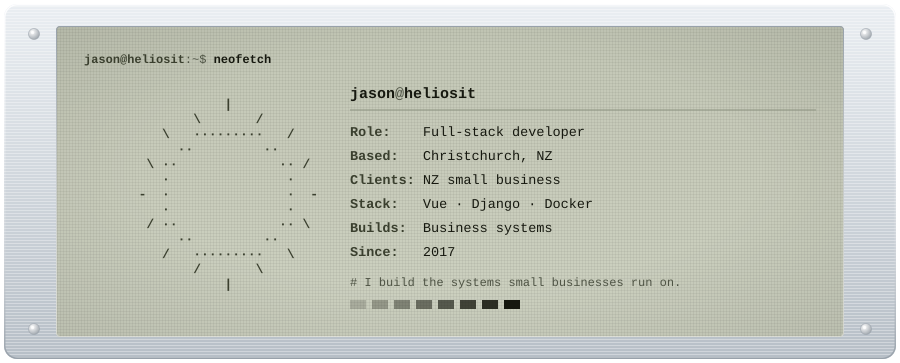
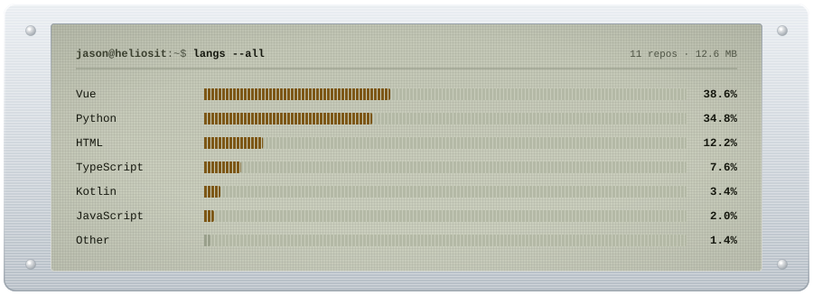

<picture>
  <source media="(prefers-color-scheme: dark)" srcset="assets/nameplate-dark.svg">
  
</picture>

Full-stack developer in Christchurch, New Zealand. I run **heliosIT**, doing
product engineering and IT consultancy for small business.

## What I do

**Build.** Long-running business systems: manufacturing and job management,
quoting, invoicing, dispatch. Mostly Vue and Django, always containerised. I've
maintained some of them for years.

**Consult.** Through heliosIT. Business websites and online stores, managed IT
and monitoring on a fixed monthly plan, and the setup work underneath it: email,
Microsoft 365 and Google Workspace, networks, dashboards, workflow automation.

**Who for.** Mostly NZ manufacturers, trades and owner-operators. Companies with
twenty staff and no IT department.

## Selected work

**VuePoint.** A manufacturing management system covering production, quoting,
invoicing, labour and dispatch, with tablet and mobile apps for the floor and
the field.

**[powerbill.co.nz](https://powerbill.co.nz).** A free NZ power-bill estimator.
Pick your region, tick your appliances, get an appliance-by-appliance breakdown
on current MBIE regional pricing. No login, and no personal data leaves the page.

**Client web.** Marketing sites and online stores for NZ businesses, built on
Nuxt. Recent work is listed on [heliosit.co.nz/portfolio](https://heliosit.co.nz/portfolio).

*Client and commercial work lives in private repositories, but I'm happy to talk
through how any of it is built.*

## Stack

<picture>
  <source media="(prefers-color-scheme: dark)" srcset="assets/stack-dark.svg">
  
</picture>

```console
$ cat ~/.stack
front    Vue 3 · Nuxt 4 · TypeScript · Tailwind · Pinia
back     Django · Python · GraphQL · PostgreSQL · Redis · Celery
mobile   Ionic Vue · Capacitor (iOS + Android)
infra    Docker · Caddy · Railway · Cloudflare Workers · Sentry
```

That chart counts every repository I own, including the private ones. The public
side of this account is three forks, so anything reading only that gets my
languages wrong. Generated by [`tools/generate_cards.py`](tools/generate_cards.py).

## Elsewhere

- `email`: [jason@heliosit.co.nz](mailto:jason@heliosit.co.nz)
- `work`: [heliosit.co.nz](https://heliosit.co.nz)
- `side`: [powerbill.co.nz](https://powerbill.co.nz)
